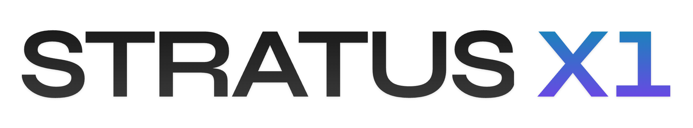

<p align="center">
  <picture>
    <source media="(prefers-color-scheme: dark)" srcset="assets/stratus-x1-dark.png">
    
  </picture>
</p>

<div align="center">

  <p><strong>TypeScript SDK for Stratus X1 — the predictive world model for AI agents.</strong></p>

  [](https://www.npmjs.com/package/@formthefog/stratus-sdk-ts)
  [](https://www.typescriptlang.org/)
  [](https://opensource.org/licenses/MIT)
  []()
</div>

---

## What is Stratus?

Stratus X1 is a **predictive action model** that sits between your LLM and the environment. It understands where an agent is, simulates what happens next, and sequences actions toward a goal — before a single real action executes.

Current LLM-based agents achieve **10–20% success rates** on real-world benchmarks. Human performance on the same tasks: **78%.** The gap isn't a prompting problem — it's structural. Agents fail because they have no state representation, no consequence prediction, and no way to plan across steps.

Stratus solves this without replacing your LLM:

- **State encoder** — compresses any observation (webpage, UI, tool response) into a rich semantic representation
- **World model** — simulates what the environment looks like after each candidate action, in representation space, before anything executes
- **Planning layer** — sequences actions toward the goal, returning a ranked plan with confidence at each step

The result: **68% fewer tokens. 2–3× faster. 2× higher task success rate.**

This SDK gives you full access to the Stratus API — chat completions (OpenAI and Anthropic formats), trajectory rollout, embeddings, LLM key management, and credits — plus embedding compression utilities and vector DB adapters for Pinecone, Weaviate, and Qdrant.

**Docs:** [stratus.run/docs](https://stratus.run/docs) · **API:** [api.stratus.run](https://api.stratus.run) · **Dashboard:** [stratus.run](https://stratus.run)

---

## Install

```bash
npm install @formthefog/stratus-sdk-ts
```

---

## Quick Start

### Chat completions (OpenAI-compatible)

```typescript
import { StratusClient } from '@formthefog/stratus-sdk-ts';

const client = new StratusClient({
  apiKey: process.env.STRATUS_API_KEY!,
});

const response = await client.chat.completions.create({
  model: 'stratus-x1ac-base-gpt-4o',
  messages: [{ role: 'user', content: 'Hello' }],
});

console.log(response.choices[0].message.content);
// Stratus metadata is available under response.stratus
console.log(response.stratus?.execution_llm);
```

### Streaming

```typescript
for await (const chunk of client.chat.completions.stream({
  model: 'stratus-x1ac-base-gpt-4o',
  messages: [{ role: 'user', content: 'Count to 5' }],
})) {
  process.stdout.write(chunk.choices[0]?.delta?.content ?? '');
}
```

### Trajectory prediction (rollout)

```typescript
const result = await client.rollout({
  goal: 'Book a flight to NYC',
  initial_state: 'On airline homepage',
  max_steps: 5,
});

console.log(result.summary.outcome);
for (const step of result.predictions) {
  console.log(step.action.action_text, step.state_change);
}
```

### Embeddings

```typescript
const result = await client.embeddings({
  model: 'stratus-x1ac-base',
  input: ['Hello world', 'Another sentence'],
});

console.log(result.data[0].embedding); // number[]
```

---

## API Reference

### `new StratusClient(config)`

```typescript
interface StratusClientConfig {
  apiKey: string;           // Required. Used as Bearer token and x-api-key header.
  apiUrl?: string;          // Default: 'https://api.stratus.run'
  timeout?: number;         // Default: 30000ms
  retries?: number;         // Default: 3 (with exponential backoff)
  compressionProfile?: 'Low' | 'Medium' | 'High' | 'VeryHigh';
}
```

### Endpoints

#### `GET /health`

```typescript
const health = await client.health();
// health.status === 'healthy'
// health.stratus_models_loaded: string[]
// health.llm_providers: string[]
// health.brain: { loaded: boolean; num_actions: number }
// health.version: string
```

#### `GET /v1/models`

No auth required.

```typescript
const models = await client.listModels();
// models.data[0].id: string (e.g. "stratus-x1ac-base-gpt-4o")
```

#### `POST /v1/chat/completions`

```typescript
const response = await client.chat.completions.create({
  model: 'stratus-x1ac-base-gpt-4o',
  messages: [{ role: 'user', content: '...' }],
  temperature: 0.7,
  max_tokens: 1000,
  // Stratus hybrid orchestration (optional)
  stratus: {
    mode: 'plan',               // 'plan' | 'validate' | 'rank' | 'hybrid'
    validation_threshold: 0.8,
    return_action_sequence: true,
  },
  // Inline LLM keys (alternative to vault)
  openai_key: 'sk-...',
  anthropic_key: 'sk-ant-...',
  openrouter_key: 'sk-or-...',
});

// response.stratus.action_sequence — planned actions
// response.stratus.overall_confidence — 0-1
// response.stratus.brain_signal — planning signal
```

Streaming:

```typescript
for await (const chunk of client.chat.completions.stream({ model, messages })) {
  // chunk.stratus appears in first chunk
}
```

#### `POST /v1/messages` (Anthropic format)

```typescript
const response = await client.messages({
  model: 'stratus-x1ac-base-claude-3-5-sonnet',
  messages: [{ role: 'user', content: 'Hello' }],
  max_tokens: 1024,
});

// response.content[0].type === 'text'
// response.stratus — Stratus metadata (extension)
```

#### `POST /v1/embeddings`

```typescript
const result = await client.embeddings({
  model: 'stratus-x1ac-base',
  input: 'Hello world',
  encoding_format: 'float', // or 'base64'
});
```

#### `POST /v1/rollout`

```typescript
const result = await client.rollout({
  goal: 'Complete the checkout',
  initial_state: 'Cart has 3 items',
  max_steps: 10,
  return_intermediate: true,
});

// result.summary.planner: 'brain' | 'action_planner'
// result.summary.action_path: string[]
// result.predictions[0].brain_confidence: number
```

#### `POST /v1/account/llm-keys`

```typescript
await client.account.llmKeys.set({
  openai_key: 'sk-...',
  anthropic_key: 'sk-ant-...',
  google_key: '...',
  openrouter_key: 'sk-or-...',
});
```

#### `GET /v1/account/llm-keys`

```typescript
const keys = await client.account.llmKeys.get();
// keys.has_openai_key: boolean
// keys.has_openrouter_key: boolean
// keys.formation_keys_available: boolean
```

#### `DELETE /v1/account/llm-keys`

```typescript
// Delete a specific provider's key
await client.account.llmKeys.delete('openai');

// Delete all keys
await client.account.llmKeys.delete();
```

#### `GET /v1/credits/packages`

No auth required.

```typescript
const { packages, network, asset } = await client.credits.packages();
// packages[0]: { name: 'starter', credits: 1000, amount_usdc: 5, ... }
// network: 'eip155:8453' (Base mainnet)
```

#### `POST /v1/credits/purchase/{package}`

x402 payment flow. Auth comes from the wallet payment header.

```typescript
const result = await client.credits.purchase('starter', base64PaymentHeader);
// result.credits_added: number
// result.stratus_api_key — only on first-ever account creation
```

---

## Error Handling

```typescript
import { StratusAPIError } from '@formthefog/stratus-sdk-ts';

try {
  await client.chat.completions.create({ ... });
} catch (err) {
  if (err instanceof StratusAPIError) {
    console.log(err.status);       // HTTP status code
    console.log(err.errorType);    // 'insufficient_credits' | 'rate_limit' | ...
    console.log(err.message);      // Human-readable message
  }
}
```

**Error types:**

| Type | Meaning |
|------|---------|
| `authentication_error` | Invalid or missing API key |
| `insufficient_credits` | Not enough credits; includes `x402` challenge |
| `rate_limit` | Too many requests |
| `invalid_model` | Model ID not recognized |
| `model_not_loaded` | Model exists but not currently loaded |
| `llm_provider_not_configured` | No LLM key set for the requested provider |
| `llm_provider_error` | Upstream LLM call failed |
| `planning_failed` | World model planning failed |
| `internal_error` | Server error |
| `validation_error` | Request validation failed |

---

## Stratus Metadata

Every chat completion and rollout response can include a `.stratus` field:

```typescript
interface StratusMetadata {
  stratus_model: string;           // e.g. "stratus-x1ac-base"
  execution_llm: string;           // e.g. "gpt-4o"
  action_sequence?: string[];      // Planned action names
  predicted_state_changes?: number[];
  confidence_labels?: string[];
  overall_confidence?: number;     // 0-1
  steps_to_goal?: number;
  planning_time_ms?: number;
  execution_time_ms?: number;
  execution_trace?: Array<{ step: number; action: string; response_summary: string }>;
  brain_signal?: {
    action_type: string;
    confidence: number;
    plan_ahead: string[];
    simulation_confirmed: boolean;
    goal_proximity: number;
  };
  key_source?: 'user' | 'formation';
  formation_markup_applied?: number;
}
```

---

## Trajectory Predictor

Higher-level wrapper for rollout operations:

```typescript
import { StratusClient, TrajectoryPredictor } from '@formthefog/stratus-sdk-ts';

const client = new StratusClient({ apiKey: '...' });
const predictor = new TrajectoryPredictor(client);

// Single prediction
const result = await predictor.predict({
  initialState: 'On checkout page',
  goal: 'Complete purchase',
  maxSteps: 5,
  qualityThreshold: 80,
});

console.log(result.summary.goalAchieved);
console.log(result.summary.qualityScore);

// Parallel predictions
const plans = await predictor.predictMany([
  { initialState: '...', goal: 'Fast approach', maxSteps: 3 },
  { initialState: '...', goal: 'Safe approach', maxSteps: 5 },
]);

// Find the best plan
const best = predictor.findOptimal(plans, { minQuality: 75 });
```

---

## Production Utilities

### Caching

```typescript
import { SimpleCache } from '@formthefog/stratus-sdk-ts';

const cache = new SimpleCache<string>(300); // 5-min TTL
cache.set('key', 'value');
const val = cache.get('key');
```

### Rate limiting

```typescript
import { RateLimiter } from '@formthefog/stratus-sdk-ts';

const limiter = new RateLimiter(10); // 10 req/sec
await limiter.wait();
const response = await client.chat.completions.create({ ... });
```

### Health checks

```typescript
import { HealthChecker } from '@formthefog/stratus-sdk-ts';

const checker = new HealthChecker(client, {
  onUnhealthy: () => console.error('API down'),
});

const status = await checker.check();
// status.healthy: boolean
// status.modelsLoaded: string[]

checker.startMonitoring(); // polls every 60s
```

### Retry with backoff

```typescript
import { retryWithBackoff } from '@formthefog/stratus-sdk-ts';

const result = await retryWithBackoff(
  () => client.chat.completions.create({ ... }),
  { maxRetries: 5, initialDelayMs: 500 }
);
```

---

## Vector Compression

Compress embedding vectors 10-20x with minimal quality loss.

```typescript
import { compress, decompress, cosineSimilarity, CompressionLevel } from '@formthefog/stratus-sdk-ts';

const embedding = new Float32Array(1536); // from OpenAI, Cohere, etc.

// Compress
const compressed = compress(embedding, { level: CompressionLevel.Medium });

// Decompress
const restored = decompress(compressed);

// Quality check
const sim = cosineSimilarity(embedding, restored);
console.log(`${(sim * 100).toFixed(2)}%`); // ~99.5%
```

### Compression levels

| Level | Ratio | Quality |
|-------|-------|---------|
| `Low` | ~5x | 99.5%+ |
| `Medium` (default) | ~10x | 97-99% |
| `High` | ~15x | 95-97% |
| `VeryHigh` | ~20x | 90-95% |

### Vector database integrations

```typescript
import { StratusPinecone, StratusWeaviate, StratusQdrant } from '@formthefog/stratus-sdk-ts';

// Pinecone — transparent compression on upsert/query
const index = new StratusPinecone(pineconeIndex, { level: CompressionLevel.Medium });
await index.upsert([{ id: '1', values: embedding }]);
const results = await index.query({ vector: queryEmbedding, topK: 10 });

// Qdrant
const qdrant = new StratusQdrant(qdrantClient, 'my-collection');
await qdrant.upsert([{ id: 1, vector: embedding }]);

// Weaviate
const weaviate = new StratusWeaviate(weaviateClient);
await weaviate.createObject({ class: 'Doc', properties: {}, vector: embedding });
```

---

## Development

```bash
npm install
npm run build      # Compile TypeScript
npm run dev        # Watch mode
```

---

## Links

- **Homepage:** https://stratus.run
- **Documentation:** https://docs.stratus.run/sdk
- **npm:** https://www.npmjs.com/package/@formthefog/stratus-sdk-ts
- **GitHub:** https://github.com/formthefog/stratus-sdk-ts

---

**Built by [Formation](https://formation.ai)**
